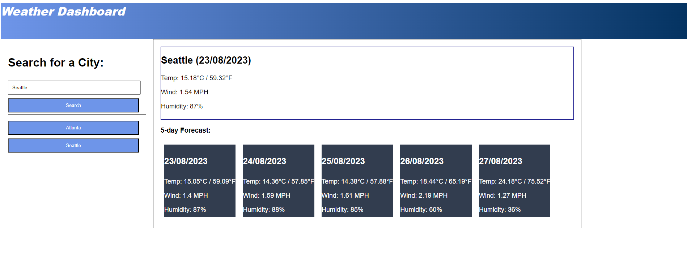

# m6-server-side-api-weather-dashboard
A took to look up 5-day forecast for cities using OpenWeather API. After searching a city the current weather will appear at the top right of teh page. 5-day forecast will appear at the bottom right.

A search history of cities will populate in the form of buttons so repeat searches can be done with a single click.

Repo: https://github.com/BenACooper/m6-server-side-api-weather-dashboard.gitLinks to an external site.

Deployed: https://benacooper.github.io/m6-server-side-api-weather-dashboard/